# WFormsApp  README!!

## Setting Up the Monaca App 
___  
1. Read more about [Monaca](https://monaca.io) from the [docs](https://docs.monaca.io/en/?_ga=2.176459429.126237752.1496340941-299224642.1494103848) and learn more. 
2. Get [NodeJS](https://nodejs.org/en/) for Windows 

3. Learn about Apache Cordova from this [link](http://cordova.apache.org/) 
4. Read widely on [npm](https://www.npmjs.com/)  
5. Create a Kinvey account from [this link](https://www.kinvey.com/) we'll use this account to setup our backend 
 
  
  ___ 
  ## The Real Stuff  
  Install NodeJS and launch _command line_ : if the installation went well you should see the following when you type `npm` or `node` in the command line. 

  1. 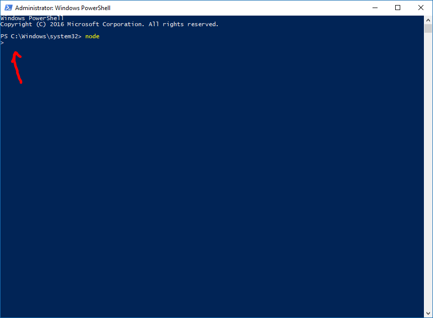  
  2. 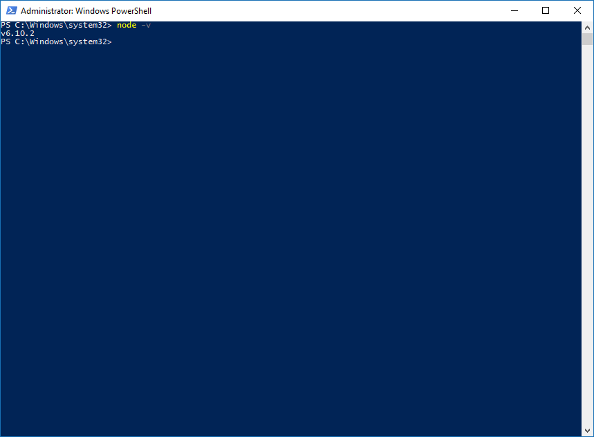 
  3. 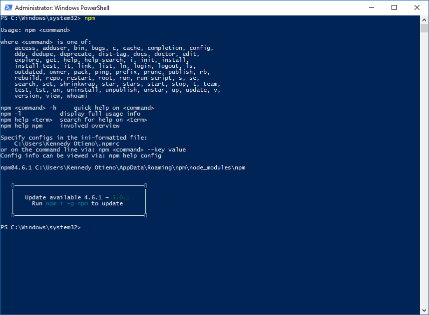  

  4. For the next steps in Setup we'll use the node command line 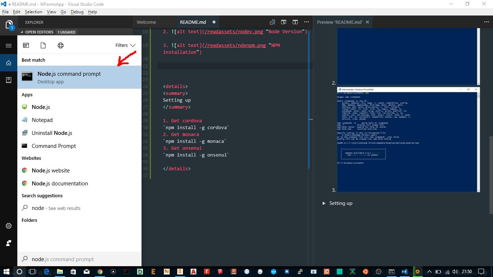 Search for **node** from the command line.
  5. If nothing appears check your path variables by searching for **environment** and select **Edit System Environment variables** 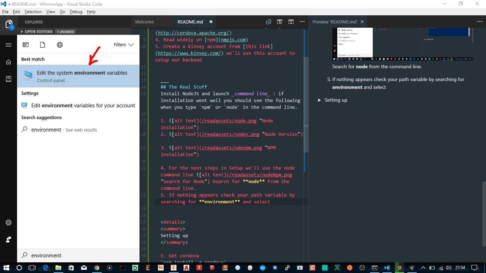 
   6. Confirm the installation path for your node setup.Ensure you can find the npm packages installation path. 
   + Select *Environment Variables* from the *Advanced tab* 
   + Under *System Variables* scroll till you get to *Path* then select *Edit* ...Look through till you find **nodejs installation folder**,if it's not already added add a **;** after the last variable then append the path to node installtion folder. 
   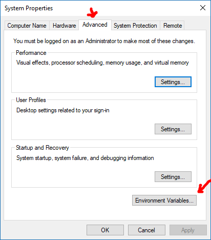 
   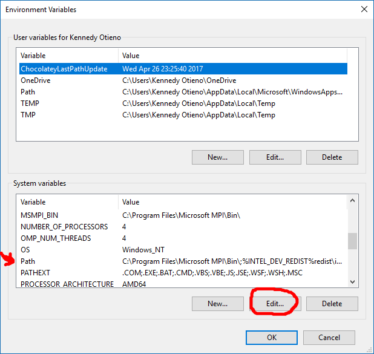 
   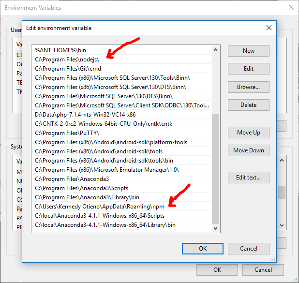 

 
 Click the Icon below to play initial setup video

 
[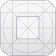](readassets/setuInit.mp4)


  <details>
  <summary> 
  Setting up
  </summary> 

  1. Get cordova 
  `npm install -g cordova` 
  2. Get monaca 
  `npm install -g monaca` 
  3. Get onsenui 
  `npm install -g onsenui` 

  </details>

 
 <details>
 <summary>
 Onsen UI more docs
 </summary>  
 
 1. Learn how Javascript ties to UI [here](https://onsen.io/v2/docs/guide/js/) 
 2. Quick Reference on all the UI components we'll need for our app [here](https://onsen.io/v2/docs/js.html) 
 3. See awesome CSS components from [this link](https://onsen.io/v2/docs/css.html) 
 4. Try out the platform from Onsen UI playground [here](http://tutorial.onsen.io/)
 </details>

 <details> 

<summary> 
TODOs 
</summary> 

1. ~Fix Icon /Logo(X)~ (Done)
2. ~Add Backend (X)~ 
3. ~Generate Icon placeholder (X)~  (Done)  
4. ~Look at [these css patterns](http://components.onsen.io/patterns)~  
5. Load maps plugin (X) 
6. Kinvey HTML5 [guide](http://devcenter.kinvey.com/html5/guides) 
7. Some [slides](https://www.slideshare.net/AlokSharma40/kinvey-howtomakeanappmobilehtml5) to go with it  
8. ~Overhaul CSS to OnsenUI @2.4.1~  
9. ~Look at this useful Login [hack](https://onsen.io/v2/api/js/ons-search-input.html)~ 
10. Implement Lazy repeat as [seen here](https://onsen.io/v2/api/js/ons-lazy-repeat.html) 
11. Fine tune Login checker func


 </details> 
 <details>
 <summary>
Done!
</summary> 
1. Stuff done goes here
 </details> 

 <details>
 <summary> 
 TO KNOW
 </summary>  

 1. Our Directory Structure is like this: 
 ```  

 acaciamobile 

 |__.monaca  <- metadata 

 |__.vscode <- metadata  

 |__platforms <- android,windows,ios etc toolchains are kept here  

 |__res <- where splashscreens and icons and and media are kept 

 |__typings <- tough to tell what happens here !  

 |__www <-where the fun stuff happens 

 |_____components <-core modules for monaca and cordova 

 |_____css <- where our custom syles reside  

 |_____js <-where our custom Javascript logic resides 

 |_____lib <-core libraries for our app 

 _________|onsenui <-all onsenui (our app's UI toolkit) style and logic components for contolling animations ,page layouts etc   
 |_____index.html <-where we manipulate the UI


 ``` 
 2. Building and Deploying application to an actual device or emulator: 
 + Ensure you have properly installed [Java 8 JDK](http://www.oracle.com/technetwork/java/javase/downloads/jdk8-downloads-2133151.html) as per [this documentation](http://docs.oracle.com/javase/7/docs/webnotes/install/windows/jdk-installation-windows.html) 
 + Download Android SDK as detailed [here](https://docs.oracle.com/cd/E60665_01/salescs_gs/OSDMA/bizcard-uc-setup002.htm#OSDMA6713) and properly set it up as [detailed here](https://spring.io/guides/gs/android/) 
 + Download and install [Apache Ant](http://ant.apache.org/bindownload.cgi) buld tool as [detailed by this blog](https://www.mkyong.com/ant/how-to-install-apache-ant-on-windows/) 
 + When ready Connect your phone to the PC and enable **USB Debugging**. This feature is disabled in most phones.You can go to **Settings>About Phone** and look for **Build Number** and tap it 7 times in rapid succession to enable it. 
 + Open Command prompt and type `adb devices` if your android developer env is properly setup you should see your device name or ip:5555 or something of the sort,if not,check if usb debugging is enabled on your phone or check if Android SDK is properly installed. 
 + From the project root directory open command prompt and type `cordova platform add android` : with proper internet this should not take more than 3 minutes. 
 + From the same directory type `cordova build android -- --ant` ;basically we're generating an Android build artifact using Ant build toolchain 
 + To deploy on your device run the following command `cordova run android -- --ant`.
 * If you're lucky: 

 `monaca platform add android` 

 `monaca build android -- --ant` 

 `monaca run android -- --ant` should work on your end ;mine failed. 
  
  + In the meantime if you don't have these set up you could always use the browser to preview your app by typing `monaca preview` from the root directory
 </details> 
   
   
  <details>
  <summary>
  Dashboard Powered by Electron 

  </summary>  

  1. Awesome material by [Tutorials point](https://www.tutorialspoint.com/electron/index.htm) 
  2. Another [Electron Gitbook](http://electron.ebookchain.org/en/tutorial/quick-start.html) 
  3. Community [materials](https://github.com/sindresorhus/awesome-electron) 
  4. Electron [Sample](https://github.com/hokein/electron-sample-apps) Apps
  </details> 

  <details>
  <summary> 
  HACKS 

  </summary> 
   
   1. We'll store our dashboard files the `dashboard` folder . 
   2. Installing `electron` normally takes a while 
      Give it some time,but you should have the following 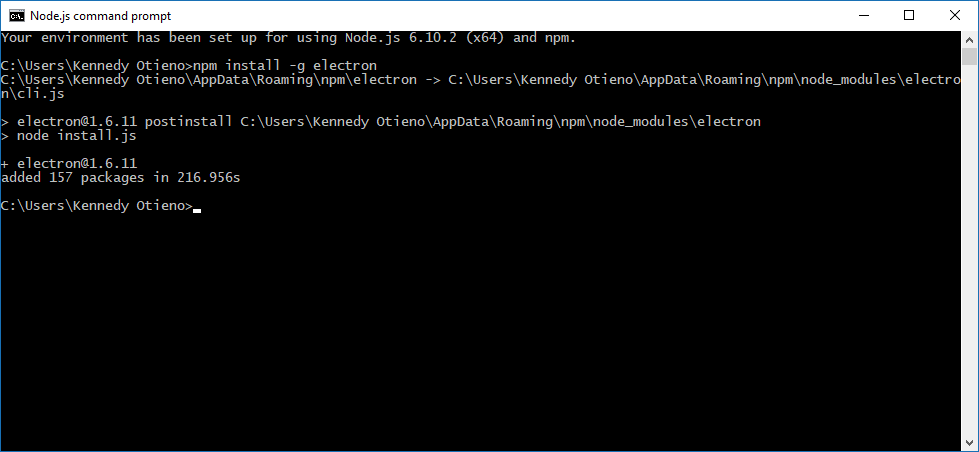 

   3. In our tool belt we can also install Generators which will allow us to quickly scaffold an electron application. 
   4. For that to work ensure you have installed `Yeoman`.Learn more from [here](http://yeoman.io/) 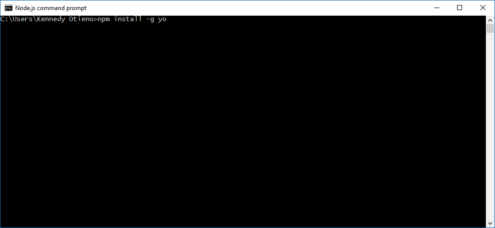 
   5. We'll then go ahead and install our Electron app Generator **We don'nt necessarily need this -since we can build an electron app from scratch-  but it will speed up the dev process** 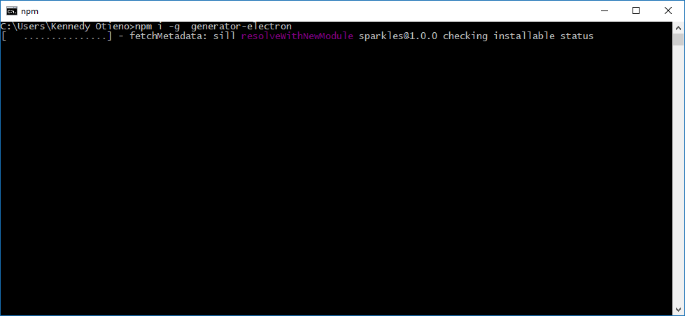 
   6. This also takes time.A successful installation should look like this 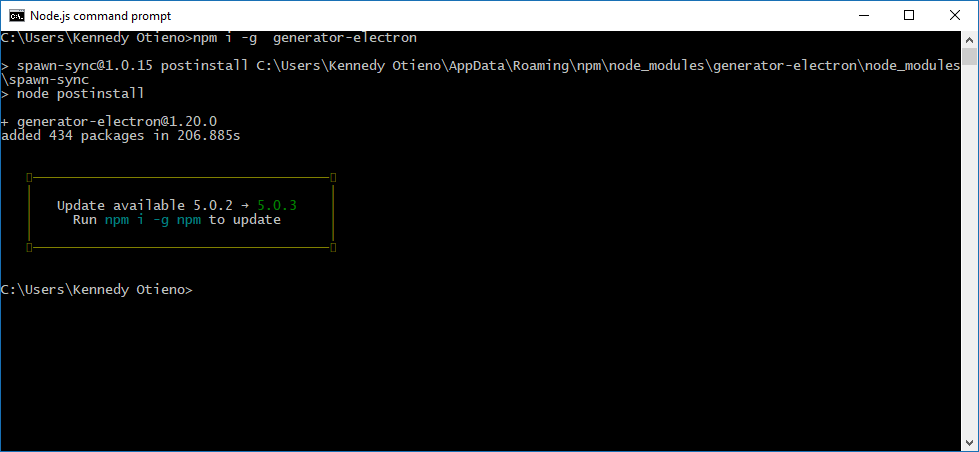 
   7. In our `dashboard\test` folder we can run the following command  
      ```bash 
      yo electron
      ```  

      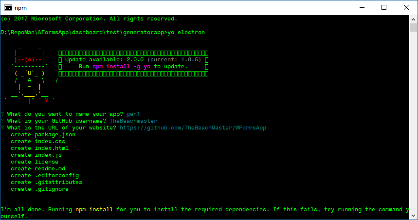  

   8. When it's done you should see the following output - _give it some time_ 

      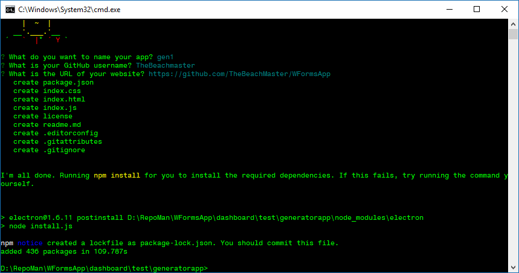 
    
    9. Running the command  
           
             electron .
            
      
       
       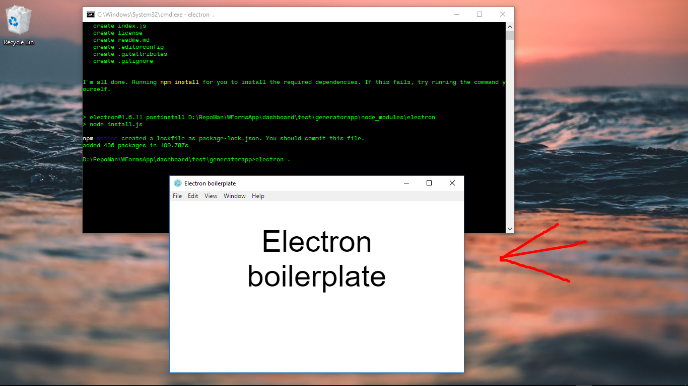 
        
    
  </details> 
   <details> 
   <summary> 
   Creating Electron Dashboard 

   </summary> 

  1. Under the `dasboard\dash` folder,there is an extracted **Dashboard Template folder** you can look at courtesy of [Creative Tim](https://www.creative-tim.com/)  
  2. Open the ``` index.html ``` file to have an overview of the LAF(look and feel) 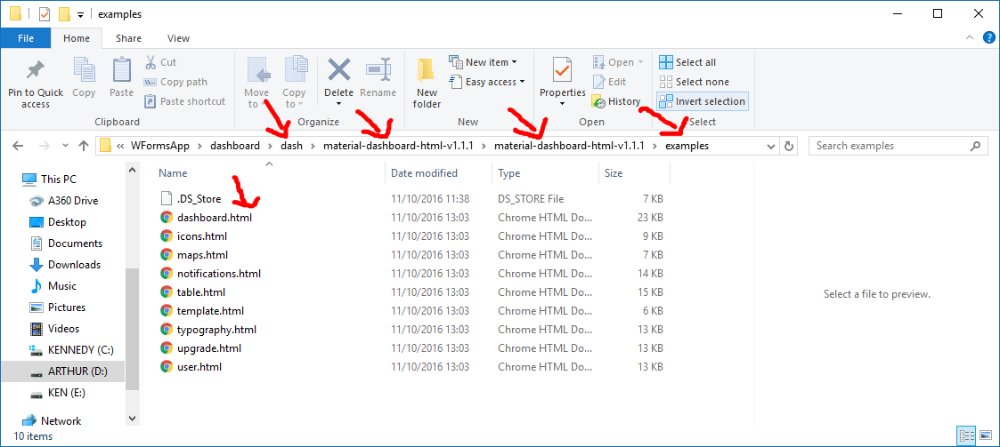 
  3. A poorly implemented Example exists in the  ```dashboard\db``` folder. 

  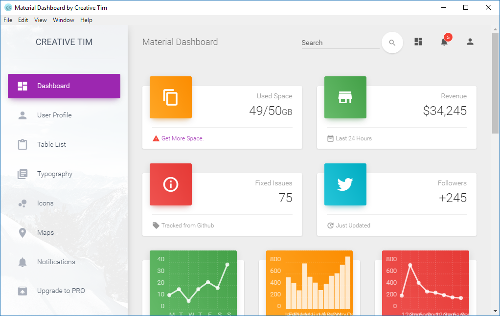
 
```bash
 Happy Hacking!
 ```
   </details>  

  <details> 

  <summary> 
    Tabs Worth Reading
  </summary>  

  1. Cordova Get [started](https://docs.microsoft.com/en-us/azure/app-service-mobile/app-service-mobile-cordova-get-started)  
  2. Working with Azure Client [SDK](https://docs.microsoft.com/en-us/azure/app-service-mobile/app-service-mobile-html-how-to-use-client-library) 
  3. Adding OAuth to [app](https://docs.microsoft.com/en-us/azure/app-service-mobile/app-service-mobile-auth)

  </details>
 
 <details> 
 <summary> 
 Working with Postman 
 </summary> 


+ Postman -at its simplest - is a desktop REST client   
+ You can basically make raw HTTP Requests to a REST API directly from Postman and view output 
+ I turned to this due to an inconsistency - I could make REST calls from the Kinvey API Console however ,I could not connect to the same API using the client library,this is certainly odd 

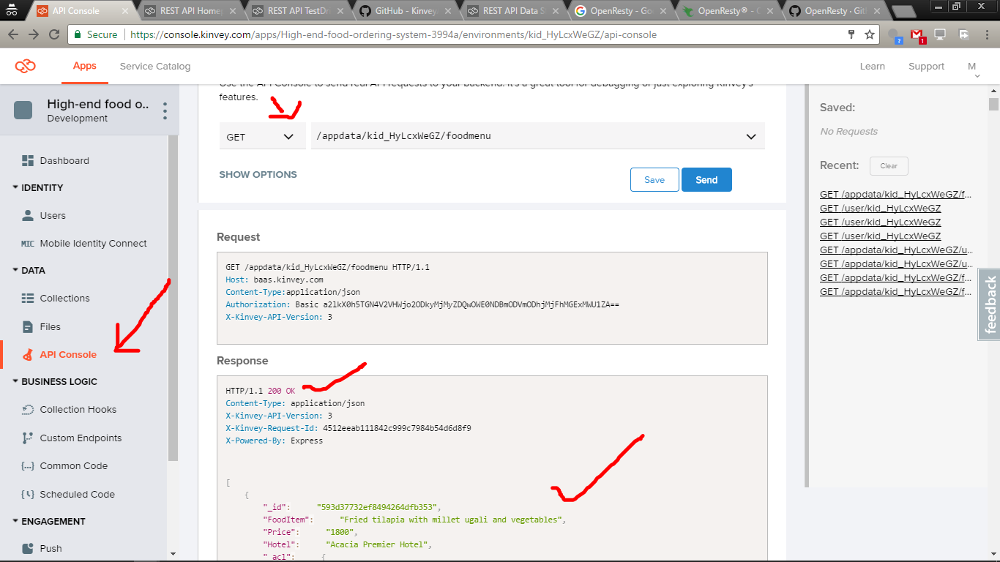 
+ However the mobile app returns a zero length array despite making a successfull connection to the same API... 
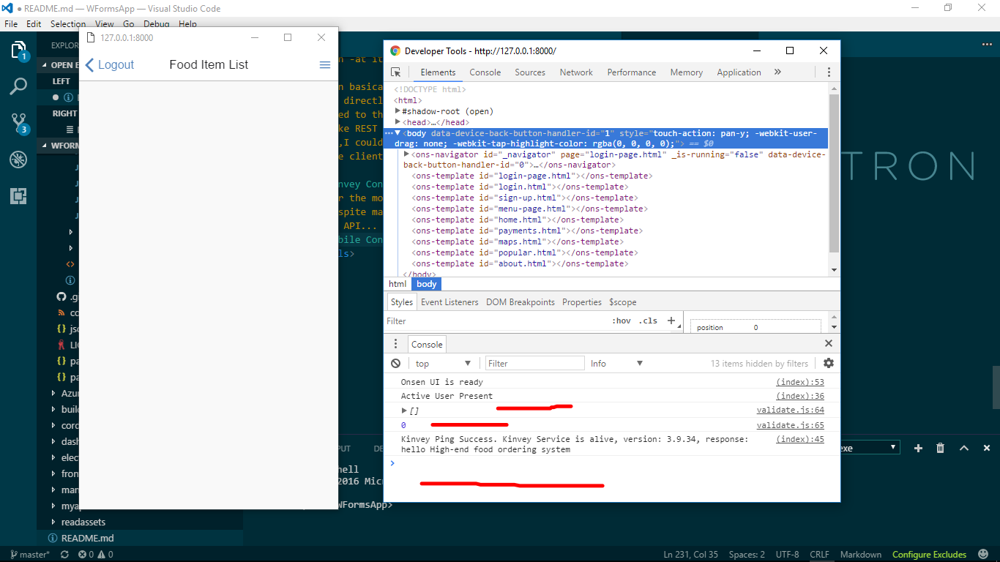 
+ What's funny? This call is being made to the same collection 
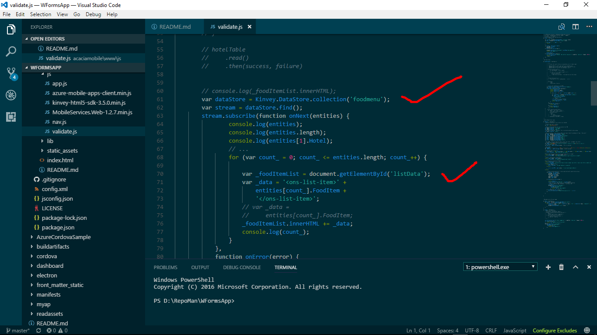 
 
 * Now **Enter Postman** 
 + You can download Postman (the supercharged API Tessing suite) for free from [this here link](https://www.getpostman.com/) 
 You'll need to do some sign in and your're in 
 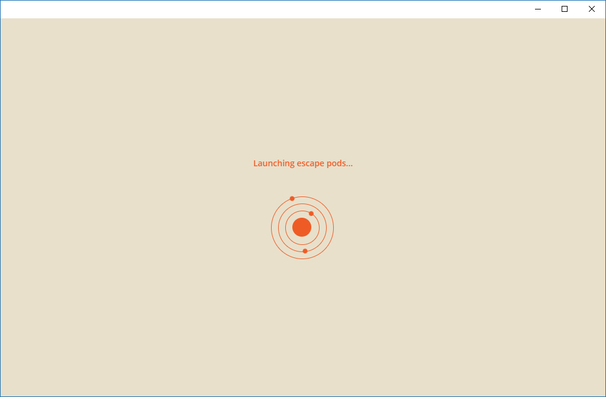 
 + You can learn more about how to use Postman to test APIs and have fun with it form [here](https://www.getpostman.com/docs/) 
 + Basically we get stuff when we do a REST call 
 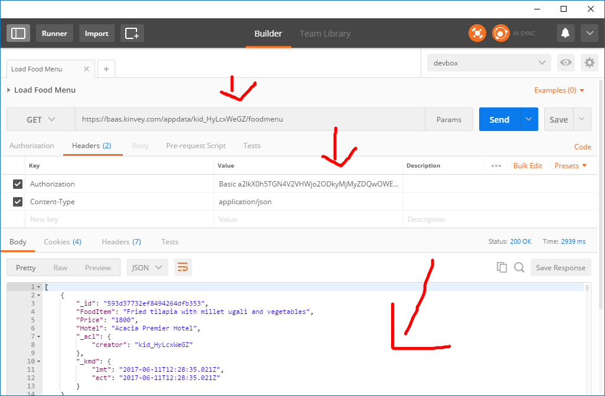 
  
  
 **Cool Thing about Postman** 

 _You can generate clientside code_  

 **How awesome is that?**  

 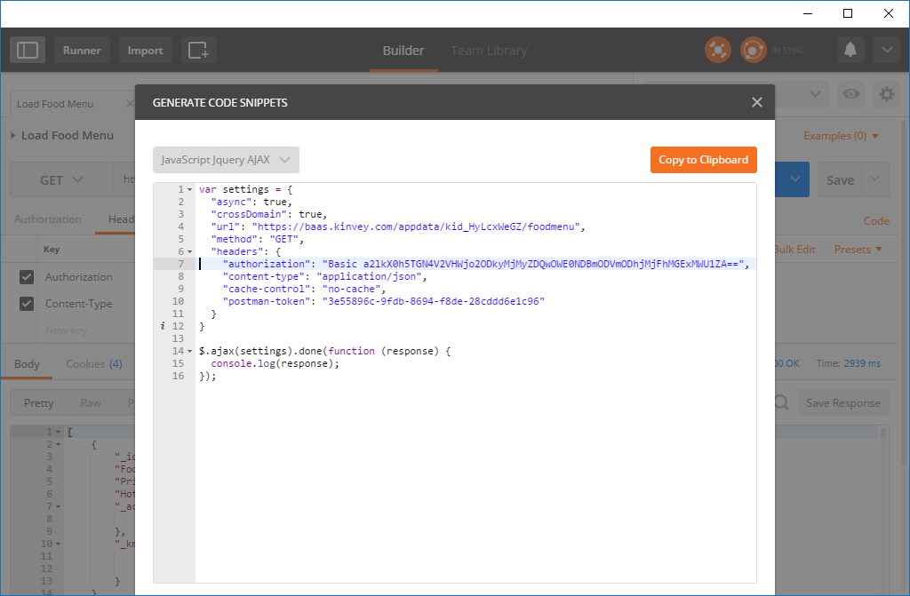  
 Click on the ```code``` link of your Postman Client  
 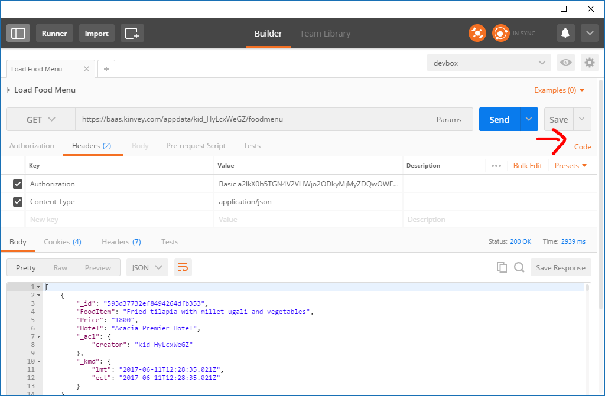
 + Let's test this ...Using stardard JQuery -nothing fancy:  
 1. And there we go...Just unapologetically copied and pasted code from Postman into our app and saw it work.... 
 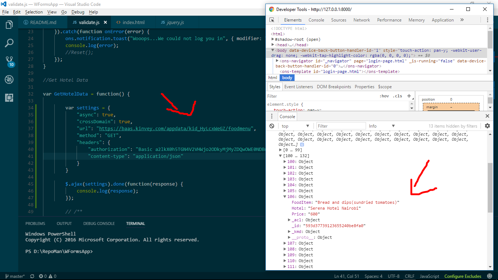  
 + Postman Deep dives on [Youtube](https://www.youtube.com/channel/UCocudCGVb3MmhWQ1aoIgUQw/videos) 
 + Use [this tool](https://www.ytddownloader.com/) to grab videos from Youtube <-if need be 
 + [](https://app.getpostman.com/run-collection/4520cca2d87fac1b817d#?env%5Bdevbox%5D=W10=) 
 + If this does not work use [this link](https://www.getpostman.com/collections/4520cca2d87fac1b817d)

 </details>
 <details> 
 <summary> 
 My surprise
 </summary> 
 Click on website.Some parts are still not working because Xampp failed me terribly!!but i tried.
 And i just learnt how to edit this readme!!i feel like a genius already. 
  
+ Get [this plugin](https://chrome.google.com/webstore/detail/responsive-web-design-tes/objclahbaimlfnbjdeobicmmlnbhamkg?utm_source=chrome-app-launcher-info-dialog)
 </details>
  
 
 <details> 

 <summary> 
 Android App Generation 

 </summary> 

 ## Getting Started -Setting Up your ENV

Get Node.JS for your OS from → [This link] (https://nodejs.org)
  
  
This will Install NodeJS and NPM 


# Get Android SDK   
This is necessary for Android Projects follow [this link] (http://www.tutorialspoint.com/android/android_environment_setup.htm)  
  
  
  
  
# Get Apache Ant    


I prefer Ant since it worked for the most part: Cordova defaults to Gradle but you can force it to use Apache Ant during buids:I'll detail later  

Get Ant from [this link] (http://ant.apache.org/manual/install.html)


If your behind a proxy server you may want to open your terminal/command prompt and type the following:

`npm config set proxy http://proxy.company.com:8080`  
`npm config set https-proxy http://proxy.company.com:8080`


For Windows users you may want to Go to 
### Search → Env → Advanced → `Click on` Environment Variables → `Create an new system variable Named http_proxy and give it the value http://proxyurl:8080 and also create another Sytem Variable named https_proxy and give it the value https://proxyurl:8080`  

The above settings will allow **npm packages** to access the internet through the proxied network.


## NPM


You'd want to install _Monaca_ and _Cordova_ 


From the Terminal/Command Prompt  type  

`$npm install cordova monaca onsenui`  

You may want to give it a sec as it goes to download components from some strange place over the internet.  

*Search for _Node_ from your system,the Node Terminal will pop up*  


#### **Windows users ignore the _$_ sign hence-forth** .


Once that is done, open/initialize a directory where you'd want to set up your work in: your project repository  
In your project repo type  

`$monaca create <Name of your App>`   

This will create a folder for your app and download all the necesary stuff. Might take a while.  
**Select a default Framework,eg _Ionic_,_VueJS_,_OnsenUI_...we're using _OnsenUI_**

**your project template can have _navigation_ or _splitter_ etc...**  


Once all has been set up, you may want *change directory in to the project root folder* and add platforms  
`$monaca platform add <platform>` where platform can be _android_ , _windows_ or _ios_ {exclusive to Mac users}. Platforms are added into a _platform_ folder.


Now you can build and test your app via browser or emulator or as an installable sandalone apk,appx...  
`$monaca build <platform> -- --ant` → to generate an insallable file or you could serve via your browser  
`$monaca preview` . 
 
 # NOTES 
 + In this process `Ant` is used as a build tool,however with a proper installation of [Gradle](https://gradle.org/install/) ,the following commands can work: 
 ```bash 
 cordova build android  
 cordova build windows
 cordova build ios
 ``` 
 ```bash 
 cordova run android 
 cordova run ios
 cordova run windows
 ``` 
 + Other commands that can be used ...TODO... 

  
Here is a nice photo of Gradle 
  

 </details> 
  
 <details>
 <summary> 
 Summaries

 </summary>  
  
  > Serving static files 
  + Install `http-server` node module through  
    ```bash 
    npm install -g http-server 
    ``` 

  + Navigate to the directory with the static html files you'd like to serve 
    ```bash
    cd root\mydeirectory\...\... 
    ``` 
  + From that directory run the following command 
      ```bash
      http-server -p 8468  
      ```  
  > You can use any port number only if it's available

   *This will serve by default `index.html` in that directory navogate to your browser to that port* 
       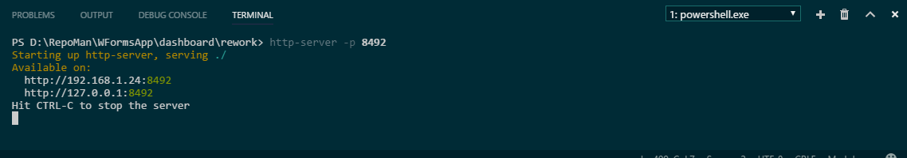 
       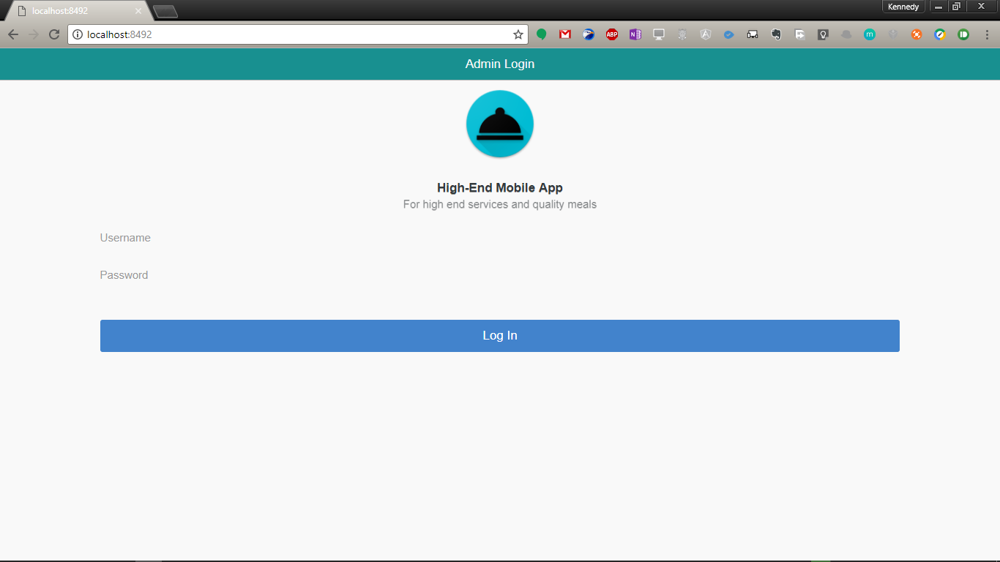
 </details> 